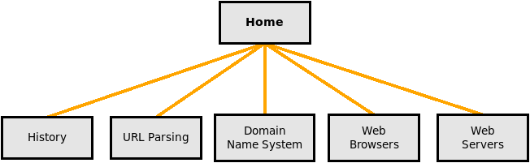

### Assignment Two: Building a Multi-Page Website using HTML and CSS

#### Learning Objectives:
1. Identify appropriate HTML syntax and basic tags.
2. Explain the structure and purpose of HTML elements.
3. Explain the structure and purpose of CSS tags.
4. Create a well-structured HTML document using best practices.
5. Identify and correct common HTML coding errors.
6. Develop a basic, functional website with multiple linked pages.
7. Style your website using Cascading Style Sheets.
8. Use Web Design and Development Best Practices

#### Instructions:

**Objective:** In this assignment, you will create a basic HTML website with multiple pages using the provided content about web systems.  You will apply best practices for web design and development to ensure your website is well-structured, accessible, and renders appropriately.

**Content:** The structure for your site indicated with the following site map:

The content for each of the pages is located in text files within the resources directory.  Browse the web for free image files, or create your own images.  *Each page must contain at least one image (photo, diagram, or screenshot)*.

**Website Structure:**
1. The root directory of your website will be the root directory of your repository.  Use your directory structure to group "like" files so that all files are not listed in the root directory. (Organize)
2. The site home page will be the "**index.html**" file in the repository root directory.
3. Use a common navigation menu on each page to link between them. (See site map)
4. Apply appropriate headings, paragraphs, lists, and links as necessary, as well as semantic tags.
5. Use CSS to style your pages.  Be consistent on your design.

#### Best Practices (Guidelines):
- Use a DOCTYPE declaration and UTF-8 encoding for HTML5.
- Include a `<head>` section with a `<title>` for each page.
- Use semantic HTML elements (e.g., `<header>`, `<nav>`, `<main>`, `<section>`, `<article>`, `<footer>`).
- Validate your HTML using online validators like the W3C Markup Validation Service (https://validator.w3.org/).
- Optimize images for the web (if any) to improve loading times.
- Include alt attributes for images.
- Prioritize the use of external style sheets. Use responsive design techniques to ensure your site renders well on multiple screen sizes (Phone, Tablet, Computer)

#### Grading Rubric:

| Criteria                          | Excellent (4) | Good (3) | Fair (2) | Needs Improvement (1) | Unsatisfactory (0) |
|-----------------------------------|---------------|----------|----------|------------------------|---------------------|
| HTML Structure & Syntax           | Demonstrates mastery of HTML structure and syntax, with no errors. | Shows a strong understanding of HTML structure, with minor errors. | Contains some HTML structural issues but still functions. | Contains several HTML structural issues, affecting functionality. | Lacks a basic understanding of HTML structure. |
| Semantic Elements                | Effectively uses semantic elements, enhancing accessibility and readability. | Utilizes some semantic elements correctly. | Uses a few semantic elements, but not consistently. | Lacks proper use of semantic elements. | No use of semantic elements. |
| Navigation                        | Implements a clear and consistent navigation menu across all pages. | Includes navigation but lacks consistency or clarity. | Navigation is present but not user-friendly. | Navigation is confusing or poorly implemented. | No navigation provided. |
| HTML Validation                   | All HTML documents pass validation without errors or warnings. | Most HTML documents pass validation with only a few minor errors. | Some HTML documents contain significant validation errors. | HTML documents contain numerous validation errors. | HTML validation not attempted. |
| Accessibility                     | Provides meaningful alt attributes for images and follows accessibility best practices. | Includes alt attributes for most images but may miss some. | Alt attributes are missing or not meaningful. | Fails to provide alt attributes for images. | No consideration for accessibility. |
| Overall Presentation & Readability | Website is well-organized, with clear content and proper formatting. | Content is organized, but there may be some formatting issues. | Content is somewhat disorganized, affecting readability. | Poor organization and formatting make content difficult to read. | Content is entirely disorganized and unreadable. |

#### Submission:
Push your Git Repository to submit your assignment.  You can push the repository multiple times.  As a rule, push at the end of your editing sessions.

